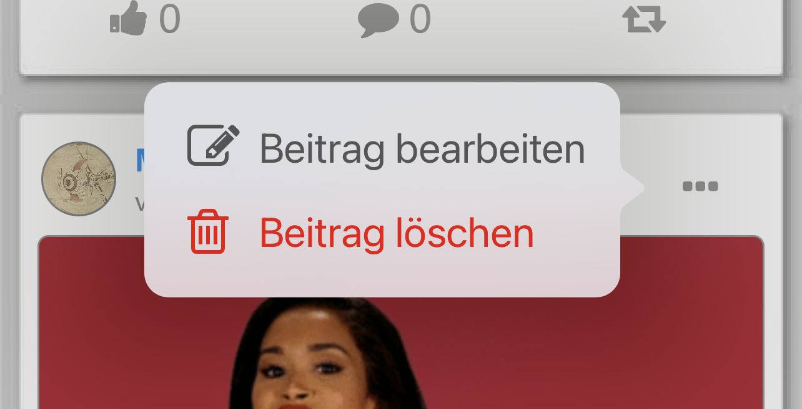
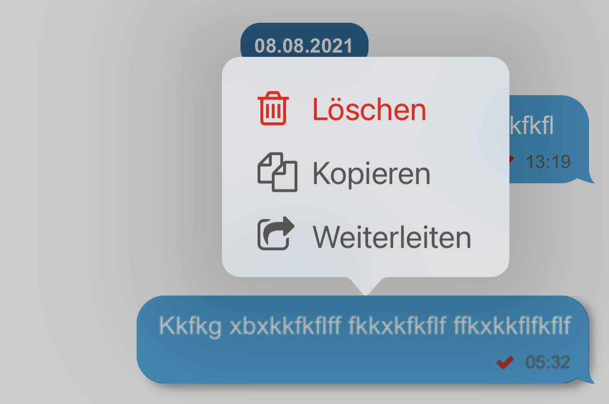

# ti.popover

## Description

Popover for iOS (Titanium Module) + more .... see in the example

same API like:
https://titaniumsdk.com/api/titanium/ui/ipad/popover.html

## Usage

	var pullViewControllerModule = require('de.marcbender.pullview');

	var pullViewControll = pullViewControllerModule.createView({
				top:0,
				bottom:0,
				left:0,
				right:0,
				parentWindow:WINDOW-OF-VIEW,
				backgroundColor:'#ffffff',
				topCornerRadius:18,
				topCornerShadowOpacity:1.0,
				topCornerShadowColor:'#000000',
				topCornerShadowOffset: {x:0, y:2},
				topCornerShadowRadius: 10,
				pullBackgroundColor:'#d0d0d0',
				extraBottomInset:ADDITIONAL-BOTTOM-INSET,
				scrollingView:TABLEVIEW-OR-LISTVIEW-OR-SCROLLVIEW,
				minHeight:MINHEIGHT-VISIBLE,
				maxHeight:MAXHEIGHT-VISIBLE,
				handleSize:30,
				handleColor:'red',
				width:Ti.UI.FILL,
				height:Ti.UI.FILL,
			});

	    win.add(pullViewControll);
