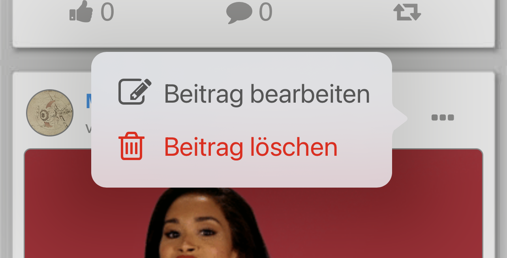
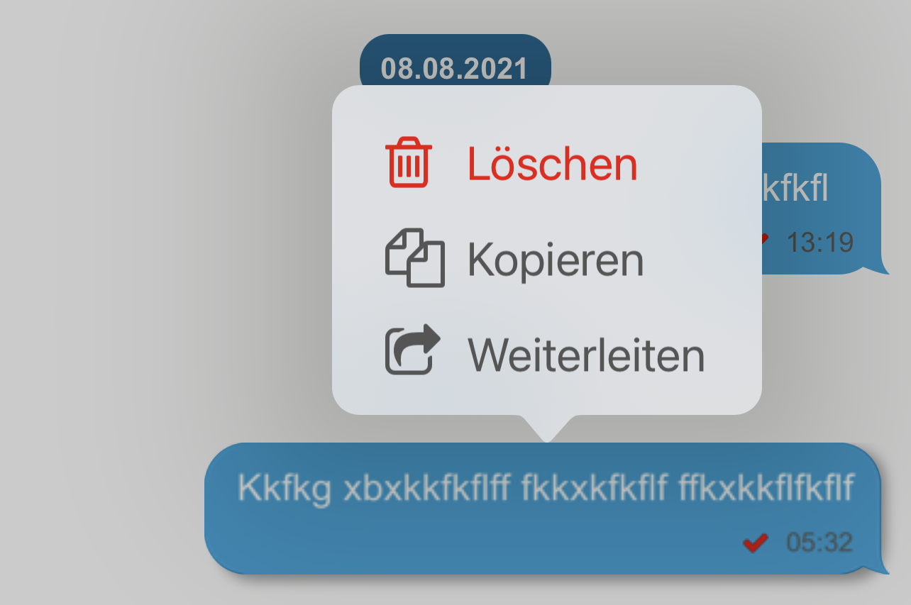

# ti.popover

A fully custom iOS Popover module implementation for Titanium Mobile.

Draws its own arrow and border using `UIBezierPath`, positions itself relative to a source view, and handles dismiss via tap gesture. Designed to mirror the [Titanium `Ti.UI.iPad.Popover`](https://titaniumsdk.com/api/titanium/ui/ipad/popover.html) API while adding extensive appearance customization.

**Platform:** iOS only  
**Version:** 2.0.0  
**Module ID:** `ti.popover`

📖 **Full Documentation:** [documentation/index.md](documentation/index.md)

---

## Features

- ✅ Custom arrow drawing with `UIBezierPath` (not `UIPopoverPresentationController`)
- ✅ 4 standard arrow directions: `UP`, `DOWN`, `LEFT`, `RIGHT`
- ✅ 8 extended corner-anchored directions: `RIGHT_TOP`, `LEFT_BOTTOM`, etc.
- ✅ Frosted glass blur effects (light/dark/extra-light)
- ✅ Dim background overlay with customizable color
- ✅ Multiple transition styles: scale, fade, translate, none
- ✅ Custom border with color and width
- ✅ Shadow effects (color, opacity, radius)
- ✅ Configurable corner radius, arrow size, and appearance
- ✅ `rect` as view-relative offset for custom anchor positioning
- ✅ Device rotation support (auto-repositioning)
- ✅ Edge clamping with smart fallback
- ✅ Single popover enforcement (only one at a time)
- ✅ Safe area inset support

---

## Installation

1. Copy the module zip (`ios/dist/ti.popover-iphone-2.0.0.zip`) to your project's `tiapp.xml`:

```xml
<modules>
    <module version="2.0.0">ti.popover</module>
</modules>
```

2. Or add via Alloy:

```xml
<Alloy>
    <Module id="ti.popover" version="2.0.0" />
</Alloy>
```

---

## Quick Start

```javascript
var ti_popover = require("ti.popover");

// 1. Create the content view
var contentView = Ti.UI.createView({
    width: 250,
    height: 200,
    backgroundColor: '#ffffff'
});
contentView.add(Ti.UI.createLabel({
    text: 'Hello from Popover!',
    color: '#333',
    top: 10,
    left: 10,
    right: 10
}));

// 2. Create the popover
var popover = ti_popover.createPopover({
    contentView: contentView
});

// 3. Show it anchored to a button
var button = Ti.UI.createButton({
    title: 'Show Popover',
    top: 50,
    width: 200,
    height: 44
});

button.addEventListener('click', function() {
    popover.show({
        view: button
    });
});

Ti.UI.currentWindow.add(button);
```

---

## Extended Arrow Directions (v2.0.0+)

Extended directions position the arrow at a **corner** with the popover extending away from that corner:

```javascript
// Arrow at top-right corner, popover extends down
ti_popover.createPopover({
    contentView: contentView,
    arrowDirection: ti_popover.ARROW_DIRECTION_RIGHT_TOP
});

// Arrow at bottom-left corner, popover extends up
ti_popover.createPopover({
    contentView: contentView,
    arrowDirection: ti_popover.ARROW_DIRECTION_LEFT_BOTTOM
});
```

| Constant | Arrow Position | Popover Extends |
|----------|---------------|-----------------|
| `RIGHT_TOP` | Right edge, top | Down from top |
| `RIGHT_BOTTOM` | Right edge, bottom | Up from bottom |
| `LEFT_TOP` | Left edge, top | Down from top |
| `LEFT_BOTTOM` | Left edge, bottom | Up from bottom |
| `UP_LEFT` | Top edge, left | Right from left |
| `UP_RIGHT` | Top edge, right | Left from right |
| `DOWN_LEFT` | Bottom edge, left | Right from left |
| `DOWN_RIGHT` | Bottom edge, right | Left from right |

---

## Rect as Offset (v2.0.0+)

The `rect` property in `show()` is interpreted as an **offset relative to the source view**:

```javascript
// Shift anchor point 50px right and 20px down from the button
popover.show({
    view: button,
    rect: { x: 50, y: 20 }
});
```

---

## Appearance Customization

```javascript
var popover = ti_popover.createPopover({
    contentView: contentView,

    // Arrow
    arrowDirection: ti_popover.ARROW_DIRECTION_DOWN,
    showsArrow: true,
    arrowWidth: 20,
    arrowHeight: 16,

    // Blur
    blurBackground: true,
    blurStyle: ti_popover.BLUR_STYLE_DARK,

    // Dim background
    showsDimBackground: true,
    dimBackgroundColor: 'rgba(0,0,0,0.3)',

    // Border
    borderWidth: 2,
    borderColor: '#3f51b5',

    // Shadow
    shadowColor: '#000000',
    shadowOpacity: 0.3,
    shadowRadius: 15,

    // Corner
    cornerRadius: 12,

    // Transition
    transitionStyle: ti_popover.TRANSITION_STYLE_SCALE,

    // Dismiss
    dismissOnTapOutside: true
});
```

---

## Transitions

| Style | Constant | Description |
|-------|----------|-------------|
| Scale | `TRANSITION_STYLE_SCALE` | Spring-scale from arrow point (default) |
| Fade | `TRANSITION_STYLE_FADE` | Fade in/out |
| Translate | `TRANSITION_STYLE_TRANSLATE` | Slide in from arrow direction |
| None | `TRANSITION_STYLE_NONE` | No animation |

---

## API Reference

### createPopover(options)

Creates a new popover instance.

| Option | Type | Default | Description |
|--------|------|---------|-------------|
| `contentView` | `Ti.UI.View` | *required* | Content view to display inside popover |
| `arrowDirection` | `Constant` | `ARROW_DIRECTION_ANY` | Arrow direction (standard or extended) |
| `showsArrow` | `Boolean` | `true` | Show/hide the arrow |
| `arrowWidth` | `Number` | `20` | Arrow width in DIP |
| `arrowHeight` | `Number` | `16` | Arrow height in DIP |
| `blurBackground` | `Boolean` | `false` | Enable frosted glass blur on popover |
| `blurStyle` | `Constant` | `BLUR_STYLE_LIGHT` | Blur style (LIGHT/DARK/EXTRA_LIGHT) |
| `showsDimBackground` | `Boolean` | `false` | Show dim overlay behind popover |
| `dimBackgroundColor` | `Color` | `'rgba(0,0,0,0.3)'` | Dim background color |
| `borderWidth` | `Number` | `0` | Border width in DIP |
| `borderColor` | `Color` | `'#000000'` | Border color |
| `shadowColor` | `Color` | `'#000000'` | Shadow color |
| `shadowOpacity` | `Number` | `0` | Shadow opacity (0-1) |
| `shadowRadius` | `Number` | `0` | Shadow blur radius |
| `cornerRadius` | `Number` | `0` | Corner radius in DIP |
| `transitionStyle` | `Constant` | `TRANSITION_STYLE_SCALE` | Presentation/dismissal animation |
| `transitionDuration` | `Number` | *auto* | Animation duration in seconds (0 = use defaults) |
| `dismissOnTapOutside` | `Boolean` | `true` | Dismiss when tapping outside |
| `safeAreaInsets` | `Object` | `{top:10, right:10, bottom:10, left:10}` | Minimum edge spacing |

### show(options)

Shows the popover.

| Option | Type | Default | Description |
|--------|------|---------|-------------|
| `view` | `Ti.UI.View` | *required* | Source view to anchor popover to |
| `rect` | `Object` | `null` | Custom rect as offset from source view |
| `animated` | `Boolean` | `true` | Animate presentation |
| `transitionStyle` | `Constant` | `null` | Override default transition for show |
| `transitionDuration` | `Number` | `null` | Override animation duration for show |

### hide(options)

Hides the popover.

| Option | Type | Default | Description |
|--------|------|---------|-------------|
| `animated` | `Boolean` | `true` | Animate dismissal |
| `transitionStyle` | `Constant` | `null` | Override default transition for hide |
| `transitionDuration` | `Number` | `null` | Override animation duration for hide |

### Events

- `show` — Fired when the popover is presented
- `hide` — Fired when the popover dismissal animation starts
- `dismiss` — Fired when the popover is fully dismissed

### Properties

| Property | Type | Description |
|----------|------|-------------|
| `isValid` | `Boolean` | Whether the popover is currently displayed |

### Constants

**Arrow Directions:**
`ARROW_DIRECTION_UP`, `ARROW_DIRECTION_DOWN`, `ARROW_DIRECTION_LEFT`, `ARROW_DIRECTION_RIGHT`, `ARROW_DIRECTION_ANY`, `ARROW_DIRECTION_UNKNOWN`

**Extended Arrow Directions (v2.0.0+):**
`ARROW_DIRECTION_RIGHT_TOP`, `ARROW_DIRECTION_RIGHT_BOTTOM`, `ARROW_DIRECTION_LEFT_TOP`, `ARROW_DIRECTION_LEFT_BOTTOM`, `ARROW_DIRECTION_UP_LEFT`, `ARROW_DIRECTION_UP_RIGHT`, `ARROW_DIRECTION_DOWN_LEFT`, `ARROW_DIRECTION_DOWN_RIGHT`

**Blur Styles:**
`BLUR_STYLE_LIGHT`, `BLUR_STYLE_DARK`, `BLUR_STYLE_EXTRA_LIGHT`

**Transition Styles:**
`TRANSITION_STYLE_SCALE`, `TRANSITION_STYLE_FADE`, `TRANSITION_STYLE_TRANSLATE`, `TRANSITION_STYLE_NONE`

---

## Important Notes

### Single Popover

Only one popover can be displayed at a time. Showing a new popover automatically hides the existing one.

### `contentView` Dimensions

Set `width` and `height` on the **content view** (using DIP values). The popover derives its size from the content view.

### Changing Properties While Visible

Appearance properties can only be changed **before** the first `show()` call. To apply new settings, create a new popover instance.

### Device Rotation

When the device rotates while a popover is displayed, it automatically repositions itself to maintain the correct anchor point.

### Edge Clamping

If an extended direction would cause the popover to go off-screen, it automatically falls back to standard centered positioning.

---

## Screenshots




---

## Example App

See `example/app.js` for a comprehensive demo with 10 examples covering all features.

---

## Author

Created by Marc Bender  
Copyright (c) 2024. All rights reserved.

## License

MIT License
